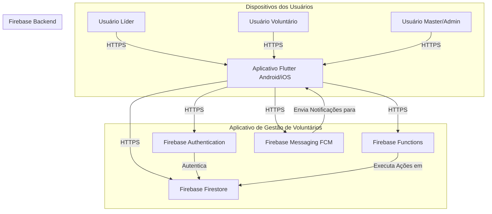
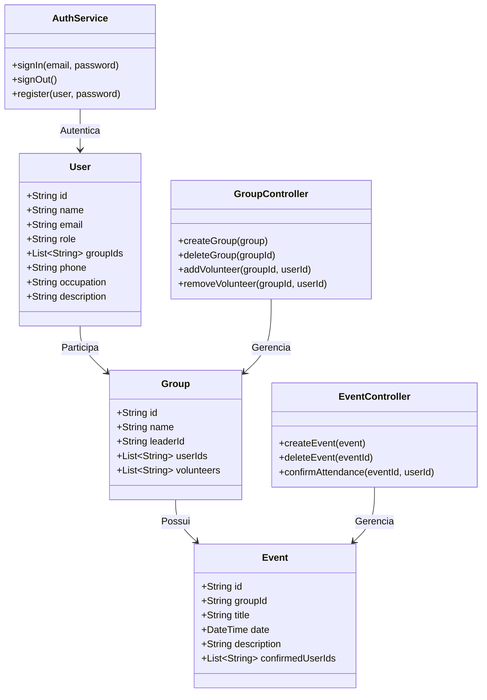

#  Aplicativo de Gestão de Voluntários  

---

##  Objetivo

O projeto consiste no desenvolvimento de um aplicativo móvel para gestão de equipes de voluntários, onde cada equipe possui um líder responsável por cadastrar voluntários e gerenciar um calendário exclusivo para a equipe. O líder pode adicionar eventos, tarefas e atualizar o calendário, enquanto os voluntários podem visualizar as atividades agendadas e receber notificações. O aplicativo visa facilitar a organização e a comunicação dentro de grupos de voluntários.

---

##  Escopo

### Incluído 
- Cadastro e autenticação de usuários (Líder e Voluntário).
- Criação e gerenciamento de grupos.
- Calendário exclusivo por grupo.
- Criação e exclusão de eventos pelos líderes.
- Confirmação de presença dos voluntários.
- Notificações push para eventos e escalas.
- Interface adaptada por tipo de usuário.

### Não incluído 
- Sistema de pontuação ou ranking.
- Compartilhamento público de eventos fora do grupo.
- Painel web administrativo.

---

##  Design de Interface

### Decisões de UI/UX
- Visual limpo com cores institucionais (azul e branco).
- Componentes com Material 3.
- Tela inicial com calendário centralizado para facilitar visualização rápida.
- Experiência distinta por tipo de usuário: Líder, Voluntário e Master.

### Protótipos
> 

---

##  Desenvolvimento

###  Tecnologias Utilizadas

#### Frontend
- Flutter (Dart) 
- Biblioteca [`table_calendar`](https://pub.dev/packages/table_calendar)

#### Backend
- Firebase Authentication 
- Firebase Firestore (NoSQL)
- Firebase Functions
- Firebase Messaging (FCM)

---

##  Qualidade

- Organização em `models/`, `controllers/`, `views/`, `services/` e `widgets/`
- Boas práticas com `flutter_lints`
- Testes com `flutter_test` (em andamento)
- Uso de `logger` para rastreabilidade de erros

---

##  Contexto

Durante a gestão de voluntários em eventos comunitários, observou-se dificuldade de comunicação entre líderes e participantes. O aplicativo resolve esse problema oferecendo uma plataforma centralizada, com escalas e notificações automáticas.

---

##  Restrições

- Apenas líderes podem editar ou excluir eventos.
- Notificações exigem que o usuário esteja com o app instalado e com permissões habilitadas.
- O app exige conexão para sincronização com o banco de dados (exceto leitura offline do calendário).

---

## Diagramas

### Diagrama de Containers

---

### Diagrama de Classes

##  Requisitos de Software

### Funcionais 
- Cadastro e autenticação de usuários (líderes e voluntários).
- Criação e gerenciamento de grupos de voluntários (apenas líderes/master).
- Adição e remoção de voluntários em grupos (apenas líderes/master).
- Criação, edição e exclusão de eventos no calendário da equipe (apenas líderes/master).
- Visualização do calendário da equipe por voluntários.
- Notificações push para avisos sobre eventos e atualizações no calendário.
- Perfil de usuário com informações básicas e histórico de participação.

### Não Funcionais 
- O aplicativo deve ser desenvolvido para iOS e Android.
- O tempo de carregamento das páginas deve ser inferior a 3 segundos.
- O banco de dados deve ser seguro e escalável.
- O código deve seguir as boas práticas de desenvolvimento (clean code).
- O aplicativo deve funcionar offline para visualização do calendário (com sincronização ao reconectar).

---

##  Modelagem

- Arquitetura baseada em MVC com separação clara entre lógica de controle, serviços e UI.
- `Controller` para lógica de negócio (`event_controller.dart`, `group_controller.dart`)
- `Service` para integração com Firebase (`auth_service.dart`, etc.)

---

##  Stacks

| Tecnologia | Badge |
|------------|--------|
| Flutter |  |
| Firebase |  |
| Firestore |  |
| GitHub |  |
| Dart |  |

---

##  Testes

- Testes unitários com `flutter_test`
- Planejamento de testes de integração para validação de lógica de eventos e permissões por função.
- Simulação de notificações via Firebase. (em fase de testes)

---

##  Repositório

[🔗 GitHub - anthonivs/TCC](https://github.com/anthonivs/TCC)
